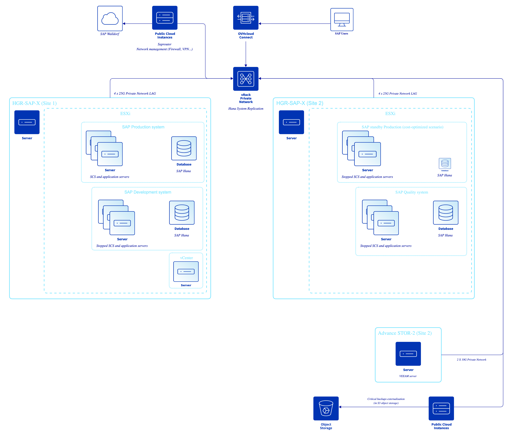

**Last updated 30th August 2022**

## Objective

This page presents the architecture concept to deploy a SAP workload on EXSi on top of a dedicated server.

Use case :

- You want to build a cost-effective SAP hosting.
- You have an entry-level size SAP landscape.
- You don't want to have a managed virtualisation layer and have internal team with these skills.

> [!warning]
>
> While the material contained in this guide has been formulated with all due care, OVHcloud does not warrant or represent that the material constitutes an official SAP guide.
>
> All technical integration, installation and/or administration tasks of SAP solutions shall be validated by a SAP professional.

## Description

In this concept, we use two HGR-SAP-XX servers which are SAP Hana TDI compliant.

They host all the SAP servers (Hana and application servers) on top of VMware ESXi hypervisor. The first site hosts the production and development systems while the second site hosts the quality and disaster recovery systems.

Even if the concept is intended to be cost-effective, we recommend to protect the production with a SAP cost-optimized scenario, that is to say in a VMware context to replicate the primary database with Hana System replication to a smaller secondary active database. The secondary production database is an active VM with less CPU/RAM. In case of a disaster recovery, the quality system VMs must be stopped in order to release the CPUs / RAM for DR production VMs. A stop / start is needed on the secondary database VMs to perform this operation.

The OSS saprouter is hosted on a dedicated public cloud instance from which link to SAP support is configured. The same instance can also be used for network facilities (routing, firewall, VPN..) if needed.

Backups can be performed using a dedicated VEEAM infrastructure deployed on a specific dedicated server designed for high storage needs (Advance STOR-2) with replicas management on public cloud object storage. The replication is made through a VEEAM proxy which is hosted on a public cloud instance, which avoids to expose public interfaces on the dedicated server used for the backups.

The connection between the SAP end-users and he infrastructure is made through OVHCloud Connect.

> [!primary]
>
> *To keep in mind :*
>
> - Pay attention to respect sizings and configurations best-practices for standby node as recommended in SAP note 1999880.
> - Respect SAP Hana on VMware vSphere 7 best-practices for sizings and resources allocation architecture (SAP note 2937606).
> - OVHcloud recommends to use asynchronous Hana System Replication between remote datacenters.
> - We do not recommend to dispatch active / active application server of the same SID on both sites.
> - It's possible to request memory upgrade on HGR-SAP-XX server (but limited by the options in the catalog).
> - We recommend to configure LACP on network interfaces, it implies to install VMware enterprise + licenses.
> - Pay attention to your needs in terms of bandwidth : we recommend minimum 25G private bandwidth for HGR-SAP hosts, 6G private bandwidth for Backup server.
> - Even if private bandwidth available is large enough, you could consider implementing QoS in VMware on replication and backup vlan in order to segregate the bandwidths.

## Schema

{.thumbnail}

## Go further

- [Detailled cookbook](https://docs.ovh.com/storage/veeam-backup-replication/) to install and configure VEEAM solution in OVHcloud.
- Best practices to configure Hana system replication on OVHcloud (coming soon).
- How to deploy Saprouter on a public cloud instance on OVHcloud (coming soon)
